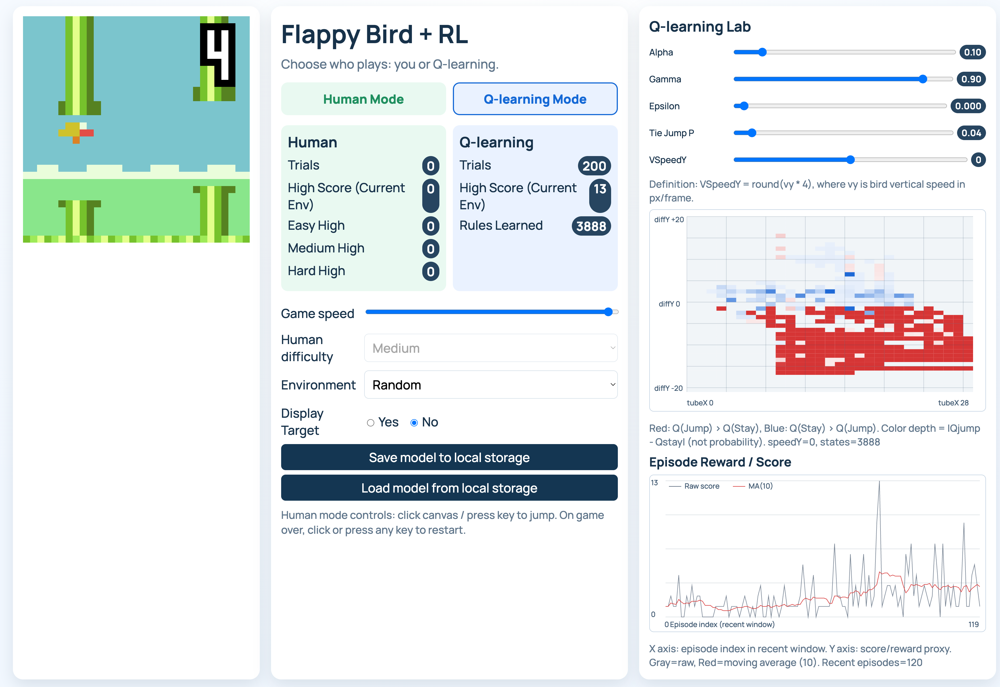

Reinforcement Learning for Flappy Bird in JS
===================

🚀 Update: Interactive Q-Learning Educational Lab
This repository is a heavily upgraded fork of the original reinforcement-learning-flappybird project. It has been transformed into an interactive, visual educational tool designed to help students and AI beginners intuitively understand how Q-learning works under the hood.

🌟 Experience the live interactive lab here: https://rlbird.xiaoyunyuan.net/

What's New in This Fork:
Dual Play Modes: Toggle between Human Mode (play it yourself) and Q-learning Mode (watch the agent learn) to compare performances.

Real-time Hyperparameter Tuning: Adjust the core Q-learning parameters—Alpha (Learning Rate), Gamma (Discount Factor), and Epsilon (Exploration Rate)—on the fly via a control panel without pausing the game.

Live Q-Table Visualization: Includes a real-time heatmap dynamically rendering the Q-Table state-action pairs. You can drag the vertical speed (vSpeedY) slider to see exactly what the bird "knows" at different velocities.

Reward & Score Tracking: A live charting widget plots the raw episode scores and a moving average, making the agent's convergence and learning progress clearly visible.

We gratefully acknowledge the original work by Nilesh Sah’s repository nileshsah/reinforcement-learning-flappybird (https://github.com/nileshsah/reinforcement-learning-flappybird), which served as the core foundation for this enhanced interactive Q-learning lab.

---

A project aimed to explain reinforcement learning in the most simplistic way ever possible by training a _32px by 32px_ game of flappy bird using Q-learning through a script written purely in JavaScript.

The script [`js/brain.js`](js/brain.js) is where the learning logic resides and has been documented heavily to explain the baseline Q-learning algorithm from scratch and how it can be applied in a real-time scenario.

With everything written solely in JS, the game can be trained and tested right inside our browser with no external dependencies at all. 

### Further Reading
---

`[1]` http://people.revoledu.com/kardi/tutorial/ReinforcementLearning/

`[2]` https://medium.com/emergent-future/simple-reinforcement-learning-with-tensorflow-part-0-q-learning-with-tables-and-neural-networks-d195264329d0

`[3]` https://www.cs.toronto.edu/~vmnih/docs/dqn.pdf

